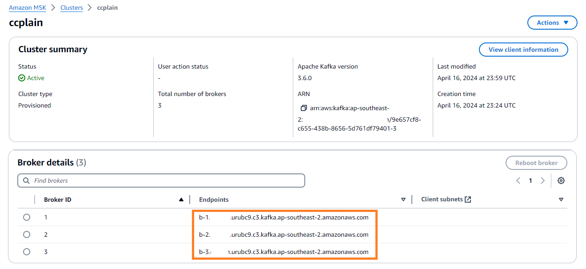
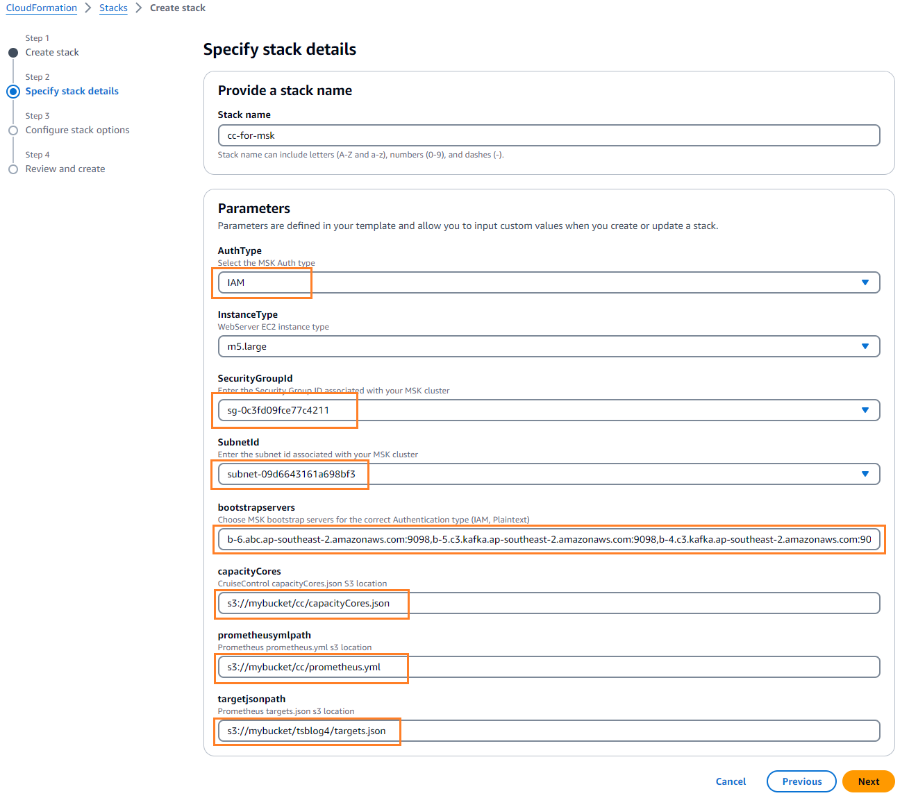
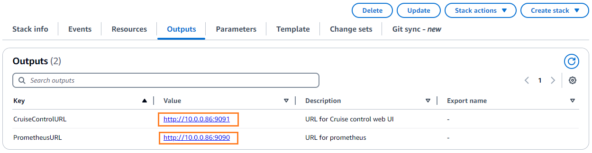
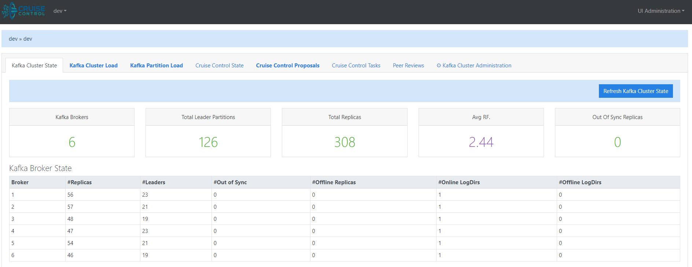

# Automated deployment template of Cruise Control for Amazon MSK
Automated deployment template of Cruise Control for [Amazon MSK](https://aws.amazon.com/msk/), a new AWS CloudFormation template that simplifies the deployment and management of [Cruise Control](https://github.com/linkedin/cruise-control) and [Prometheus](https://docs.aws.amazon.com/msk/latest/developerguide/open-monitoring.html) for monitoring and rebalancing Amazon MSK clusters.
Amazon MSK is a fully managed service that makes it easy to build and run applications that use Apache Kafka to process streaming data. With this new CloudFormation template, you can now seamlessly integrate Cruise Control and Prometheus to gain deeper insights into your Amazon MSK cluster's performance and optimize resource utilization.

By automating the deployment and configuration of Cruise Control and Prometheus, you can significantly improve operational efficiency, reduce the time and effort required for manual setup and maintenance, and allow you to focus on higher-value tasks.

The CloudFormation template itself streamlines the deployment process by automating the provisioning of an EC2 instance with Cruise Control and Prometheus pre-configured. This not only eliminates the need for manual setup and configuration but also reduces the risk of errors and ensures consistent deployments across the environments.

## Key features
- Automated provisioning of an EC2 instance with Cruise Control and Prometheus pre-configured, eliminating the need for manual setup and configuration.
- Support for Amazon MSK provisioned mode cluster.
- Flexible authentication with PlainText or IAM. 
- No Zookeeper dependency for Cruise Control.
- Easily customize Prometheus targets, Cruise Control capacity settings, and other configurations by providing your own configuration files stored in an S3 bucket.

## Prerequisites

- An existing Amazon MSK Kafka cluster
- Enable open monitoring with [Prometheus] (https://docs.aws.amazon.com/msk/latest/developerguide/open-monitoring.html)
- An S3 bucket with the following files:
  - [`targets.json`](config\targets.json) (Prometheus targets configuration)
  - [`prometheus.yml`](prometheus.yml) (Prometheus configuration)
  - [`capacityCores.json`](config\capacityCores.json) (Cruise Control capacity configuration)
- An EC2 security group that has access to your target MSK cluster. The simplest approach would be to use the same security group attached to your MSK cluster, which includes a self-referencing inbound rule allowing all traffic.

## Parameters

The following parameters need to be provided when creating the CloudFormation stack:

- `InstanceType`: The EC2 instance type for the web server (default: `m5.large`).
- `targetjsonpath`: The S3 location of the `targets.json` file for Prometheus.
- `prometheusymlpath`: The S3 location of the `prometheus.yml` file for Prometheus.
- `AuthType`: The authentication type for the MSK cluster (default: `IAM`).
- `bootstrapservers`: The bootstrap servers for the MSK cluster.
- `capacityCores`: The S3 location of the `capacityCores.json` file for Cruise Control.
- `SubnetId`: The subnet ID associated with the MSK cluster.
- `SecurityGroupId`: The security group ID associated with the MSK cluster.

## Resources

The CloudFormation template creates the following resources:

- **EC2 Instance**: An EC2 instance with Cruise Control and Prometheus installed and configured.
- **IAM Instance Profile**: An IAM instance profile with the necessary permissions for the EC2 instance to access the MSK cluster and S3 buckets.
- **IAM Role**: An IAM role assumed by the EC2 instance with the required policies attached.

## Outputs

After the stack is created, the following outputs will be available:

- `PrometheusURL`: The URL for accessing the Prometheus web UI.
- `CruiseControlURL`: The URL for accessing the Cruise Control web UI.

## Step by step

1. Clone the git repository to your local machine. Navigate to the config folder.
2. Update the `targets.json` file with the correct broker DNS names for your Kafka cluster.

3. Update the `capacityCores.json` file according to the instance type of your Kafka cluster nodes. The example provided in the file is for the m5.large instance type.
4. Upload the modified `targets.json`, `prometheus.yml`, and `capacityCores.json` files to an S3 bucket.
5. Create a new CloudFormation stack using the provided CloudFormation template (`msk-cruise-control-deploy.yaml`), specifying the required parameter values, such as the S3 bucket name and object keys for the uploaded files.
6. Once the CloudFormation stack creation is complete, use the output URLs provided by CloudFormation to access the Prometheus and Cruise Control web UI. **However, please allow an additional 15 minutes before accessing those URLs, as the installation of Cruise Control may still be in progress.**

Notes: 
- During the CloudFormation stack creation process, you will need to specify a subnet and security group associated with your Amazon MSK cluster. The EC2 instance hosting Prometheus and Cruise Control will be launched within the chosen subnet and assigned the specified security group. This configuration ensures that the EC2 instance can communicate seamlessly with the Kafka brokers in your MSK cluster.
- You can access the EC2 instance using AWS Systems Manager Session Manager (https://docs.aws.amazon.com/systems-manager/latest/userguide/session-manager.html), which has been preconfigured to allow access through the AWS Management Console without requiring an SSH key.

## Sample output

